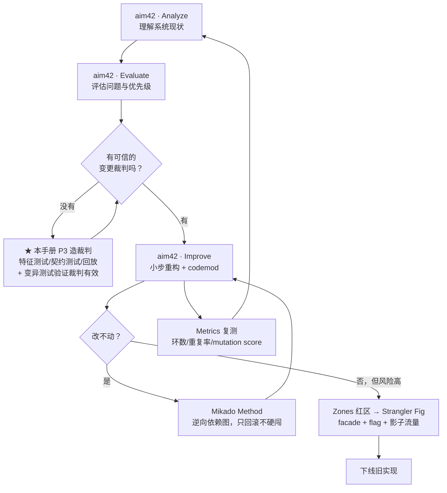

# 社区已有的方法地图 —— 别重新发明

> 这份文件回答两个自查问题：**(1) 我是否充分用了现成的开源工具？(2) 社区是否已经有现成的流程图？**
> 结论：工具上我重复造了轮子；图上我基本没查。下面是补齐后的结果。

---

## 一、社区已有的流程图 / 方法论（直接可用，不必自创）

| # | 方法 | 出处 | 形态 | 与本手册的关系 |
|---|---|---|---|---|
| 1 | **aim42 · Architecture Improvement Method** | [aim42.github.io](https://aim42.github.io/) | **三阶段迭代闭环：Analyze → Evaluate → Improve**，附完整的 patterns & practices 目录 | **应作为上位框架**。本手册的 P0~P2 ≈ Analyze；P5/P6 ≈ Improve。本手册只是它在 AI agent 时代的操作细化 |
| 2 | **Mikado Method** | [understandlegacycode.com](https://understandlegacycode.com/blog/a-process-to-do-safe-changes-in-a-complex-codebase/) | **逆向依赖图**：先"试着改"，一失败就把挡路的依赖记成一个节点，只回滚、不硬闯，直到能自底向上一次做完 | **补上本手册缺的一环**：改到一半发现动不了时该怎么办 |
| 3 | **Strangler Fig** | [Azure Architecture Center](https://learn.microsoft.com/en-us/azure/architecture/patterns/strangler-fig) / [Fowler bliki](https://martinfowler.com/bliki/StranglerFigApplication.html) / AWS Prescriptive Guidance | 官方架构图 + 分步时序 | 对应本手册 P6，直接照抄官方图 |
| 4 | **Patterns of Legacy Displacement** | [martinfowler.com](https://martinfowler.com/articles/patterns-legacy-displacement/) | 一整套带图的替换模式（Event Interception、Legacy Mimic、Divert the Flow…） | 比本手册 P6 细得多，是它的上位 |
| 5 | **Zones 框架（绿/黄/红风险分区）** | [Addy Osmani, 2026-09](https://addyo.substack.com/p/brownfield-agentic-engineering) | 按**风险**把代码库分区：绿=隔离+测试好，黄=质量参差，红=鉴权/计费/权限 | 与本手册 P2 的 **LIVE/DEAD/UNKNOWN** 互补——**建议合并成二维分诊表** |
| 6 | **BMad-Method · Brownfield Guide** | [github](https://github.com/bmad-code-org/BMAD-METHOD/blob/main/src/modules/bmm/docs/brownfield-guide.md) | 开源框架里现成的 brownfield 工作流（含 agent 分工） | 想要开箱即用的 agent 编排，直接用它，不必自己攒 |
| 7 | **Anthropic · The Code Modernization Playbook** | [PDF, 2025-09](https://resources.anthropic.com/hubfs/Code%20Modernization%20Playbook.pdf) | 厂商级完整 playbook：迁移策略、评估框架、ROI、团队就绪度 | 需要向上面要预算/交差时用它，比本手册更有说服力 |
| 8 | **Software Reviews（结构化系统盘点）** | Koppelt / Harrer / Starke 等 | 从业务层逐级盘到代码层的清单式方法 | 本手册 P1 的"该问哪些问题"可以直接抄它 |
| 9 | **RefAgent 论文 Figure 1** | [arXiv 2511.03153](https://arxiv.org/abs/2511.03153) | 多 agent 重构回路架构图（plan / execute / test / refine） | 本手册 P5 的 agent 编排参考图 |

### 1.1 最重要的一条：本手册的定位应该是"aim42 的 AI 化补丁"

aim42 已经在 2015 年就把「分析 → 评估 → 改进」的迭代闭环和上百个实践整理完了，社区用了十年。本手册相对它的**增量只有一条**：

> **在 Analyze 和 Improve 之间，插入了 P3「造裁判」这个 AI 时代的新增必选阶段。**
> 因为在 agent 能 24 小时不间断改代码的时代，"改得够快"不再是瓶颈，"知道有没有改坏"才是。

所以正确的写法不是「我的七阶段」，而是：

---

## 二、自查：我重复造了哪些轮子

| 我脚本里自己写的 | 现成的开源工具 | 结论 |
|---|---|---|
| 按扩展名统计文件数/行数 | **scc**（[boyter/scc](https://github.com/boyter/scc)）、**tokei**、**cloc**、gocloc | ❌ 重复造轮子，应直接调用 |
| `git log --name-only` 数变更频次 | **code-maat**（[adamtornhill/code-maat](https://github.com/adamtornhill/code-maat)）、hercules、git-quick-stats、git-of-theseus | ❌ 重复；code-maat 正是 Adam Tornhill《Your Code as a Crime Scene》的配套工具，比我这几行可靠得多 |
| 自己找"最大的文件" | **lizard** / **radon**（圈复杂度）、**scc --by-file** | ❌ 我数的是行数，人家数的是复杂度，后者才对 |
| 自己判断"测试占比" | 覆盖率工具 + **SonarQube CE** | ⚠️ 文件名匹配 ≠ 有效测试覆盖 |

**修正动作**：`phase0-recon.ps1` 已重写为**调度器**——检测到 scc/tokei/code-maat/jscpd 就调用它们，只有都不存在时才退回内置实现，并在报告里明确标注数据来源。

---

## 三、我完全漏掉、但应该加进工具矩阵的

| 类别 | 工具 | 为什么重要 |
|---|---|---|
| **重构历史挖掘** | **RefactoringMiner** | 能从这个仓库的 git 历史里挖出它**历史上做过哪些重构**——直接告诉你这个团队的既有习惯，也验证了 SWE-Refactor 的数据来源 |
| **架构可视化** | **CodeCharta**（MaibornWolff，开源） | 把代码指标渲染成 3D 城市地图，一眼看出"城区"和"废墟" |
| **质量平台（一体机）** | **SonarQube Community Edition** | 重复率 + 复杂度 + 认知复杂度 + 覆盖 + 热点，一个平台全给。我原手册把这几件事拆给四个工具，属于没用好现成的 |
| **债务/改进项管理** | **scope42** | aim42 的配套工具，把改进项变成可追踪的 backlog |
| **按语言找工具** | [analysis-tools.dev](https://analysis-tools.dev/) | 与其我硬编一张矩阵，不如让用户按语言去这个站查 |
| **运行时全景** | [OpenAPM landscape](https://openapm.io/landscape) | P2「定活」要接的 APM 生态 |
| **密钥泄漏扫描** | **gitleaks** | 重构前先扫；老仓库里躺着的密钥被 agent 大规模读进上下文是真实风险 |
| **仓库体积/异常** | **git-sizer** | 判断这个库是不是已经被大文件/生成物污染 |
| **AI 时代现代化清单** | [awesome-agentic-software-modernization](https://github.com/feststelltaste/awesome-agentic-software-modernization) | Markus Harrer 维护，2026-09 仍在更新。**本手册的大部分结论都能在这里找到更早的出处** |
| **经典遗留系统清单** | [awesome-legacy-systems](https://github.com/feststelltaste/awesome-legacy-systems) | 经典书单/演讲/播客 |
| **中文现代化工具集** | [modernizing/awesome-modernization](https://github.com/modernizing/awesome-modernization) | 部分中文 |
| **维护地狱工具集** | [sparsick/maintenance-talk](https://github.com/sparsick/maintenance-talk) | 实战工具清单 |
| **多 agent 并行的实证** | Bun 用 64 个 Claude 实例 + git worktree，11 天把 53.5 万行 Zig 重写成 Rust（implementer + reviewer 分离上下文） | P5 的并行化上限参考 |

---

## 四、结论：我该改的三件事（已改）

1. ✅ **侦察脚本降级为调度器** —— 优先调 scc / tokei / cloc / code-maat / jscpd，内置实现只作兜底，并标注来源。
2. ✅ **手册挂到 aim42 之下** —— 不再宣称"七阶段"，而是"aim42 + 一个 AI 时代新增的 P3"。
3. ✅ **补上 Mikado Method** —— 本手册原先没有回答"改到一半发现动不了怎么办"，这是真实高频场景。

---

## 五、一句话

> 社区在这件事上已经积累了 **十年**（Feathers 2004 / aim42 2015 / Tornhill 2015 / Fowler 的 Legacy Displacement），
> AI 只改变了其中**一个环节**——「造裁判」从"有空再做"变成了"必须先做"。
> 把新东西接到老框架上，比重新发明一个框架省力得多。
